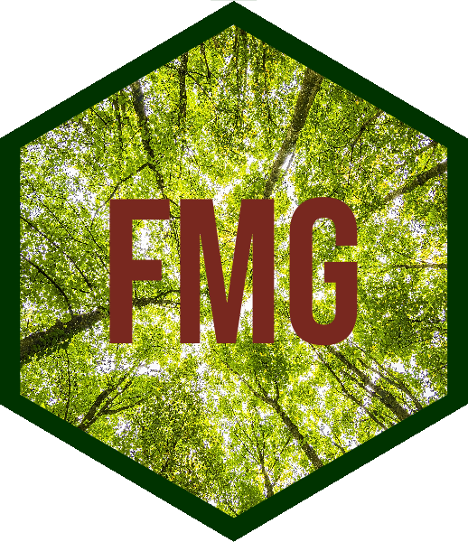

<!-- README.md is generated from README.Rmd. Please edit that file -->

# fmgr

R package for Forest Management Geodatabase reporting.

## Project Status

## Description

The `fmgr` R package contains functions for producing standard reporting
products from the Forest Management Geodatabase (FMG).

## Funding

Funding for the development and maintenance of the Forest Management
Geodatabase (FMG) has been provided by:

-   USACE Rock Island District, Operations Division, Mississippi River
    Project, Natural Resources.

------------------------------------------------------------------------

## Latest Updates

Check out the [NEWS](NEWS.md) for details on the latest updates.

------------------------------------------------------------------------

## Authors

-   [Michael Dougherty](mailto:Michael.P.Dougherty@usace.army.mil),
    Geographer, Rock Island District, U.S. Army Corps of Engineers
-   [Christopher Hawes](mailto:Christopher.C.Hawes@usace.army.mil),
    Geographer, Rock Island District, U.S. Army Corps of Engineers
-   [Ben Vandermyde](mailto:Benjamin.J.Vandermyde@usace.army.mil),
    Forester, Rock Island District, U.S. Army Corps of Engineers
-   [Lauren McNeal](mailto:Lauren.J.McNeal@usace.army.mil), Forester,
    Rock Island District, U.S. Army Corps of Engineers
-   [Amanda Ross](mailto:Amanda.L.Ross@usace.army.mil), Geographer, Rock
    Island District, U.S. Army Corps of Engineers

------------------------------------------------------------------------

## Install

To install the `fmgr` package, install from GitHub using the `remotes`
package:

    remotes::install_github(repo = "ForestManagementGeodatabase/fmgr")

## Bug Reports

If you find any bugs using `fmgr`, please open an
[issue](https://github.com/ForestManagementGeodatabase/fmgr/issues).
